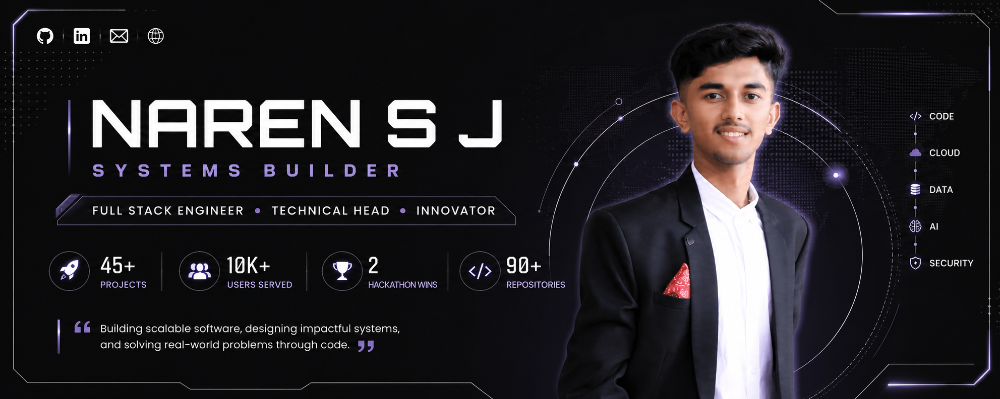
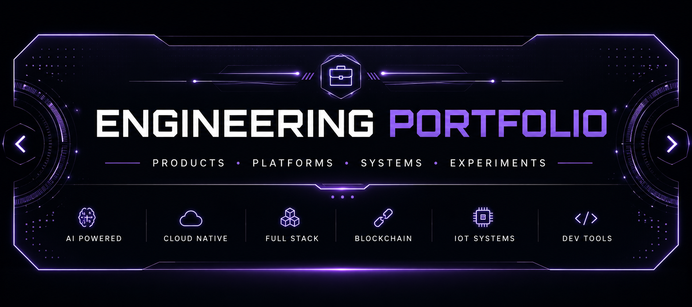
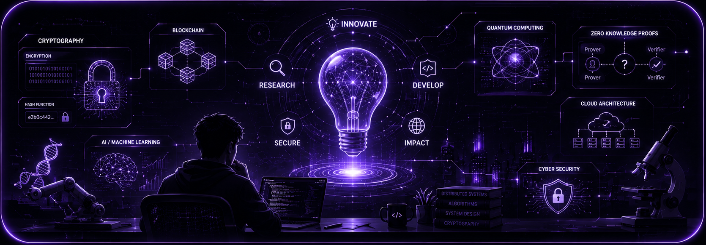
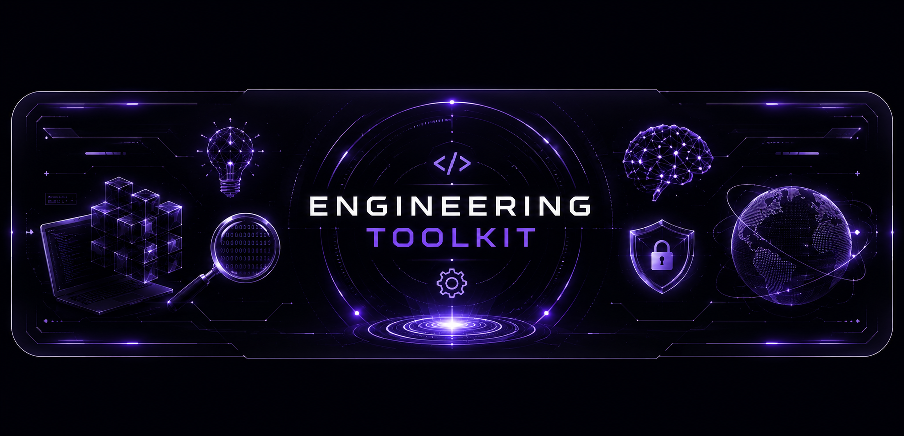
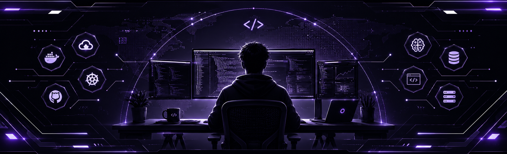

<div align="center">



<br>

### Systems Builder • Full Stack Engineer • Technical Head


<br>

<a href="https://narensj.netlify.app">

</a>

<a href="https://linkedin.com/in/narensj20">

</a>

<a href="https://github.com/Naren1520">

</a>

<a href="mailto:narensonu1520@gmail.com">

</a>

</div>

---

#  About Me

I'm a software engineer passionate about building **high-performance systems**, **production-ready web platforms**, and **scalable backend architectures**.

Rather than simply developing applications, I enjoy solving engineering problems—from distributed systems and real-time communication to cloud infrastructure and AI-powered automation.

Currently, I'm working on products used by thousands of users while researching secure offline payment architectures and continuously exploring modern system design.

---

#  Engineering Snapshot

<div align="center">

| 🚀 Projects | 🏢 Production Platforms | 👥 Users Served | 🏆 Hackathons |
|:----------:|:----------------------:|:--------------:|:------------:|
| **45+** | **10+** | **10K+** | **2 Wins** |

| 💻 Repositories | 🤖 AI Projects | ☁ Cloud | 📚 Research |
|:--------------:|:-------------:|:-------:|:-----------:|
| **90+** | **8+** | **AWS · Docker · Kubernetes** | **Offline Payments** |

</div>

---

#  Currently Building

```text
🚀 SPManager: AI Powered Project Management Platform

🧠 Cryptographic Offline Payment Protocols

⚙ High Performance Backend Systems

☁ Cloud Native Applications


```

---

#  Engineering Philosophy

```cpp
while (alive)
{
    Learn();
    Build();
    Improve();
    Share();
}
```

> **"I enjoy building software that is scalable, maintainable, and solves real-world problems—not just applications that work."**

---


<div align="center">


> Over the years, I've explored multiple domains—from AI-powered platforms and enterprise systems to blockchain, IoT, developer tools, and interactive web experiences. Every project has contributed to expanding my understanding of scalable software engineering.

<br>

<table width="100%">

<tr>

<td width="33%" valign="top">

## 🏢 Production

- 🚀 SPManager
- 🎓 Placement Management
- 🎪 Aerophilia
- 🏫 Hostel Management
- 🏛️ ISDC Platform
- 📚 MBA Portal
- 🍽️ Tandoor
- 🌐 Portfolio

</td>

<td width="33%" valign="top">

## 🤖 Artificial Intelligence

- 🧠 Vanijya AI
- 📄 BrainScript
- 💬 AI Assistant
- 🎨 AI Image Generator
- 🔎 Snap Search
- 🚦 Traffix AI
- 🛡️ WAF Transformer
- 📊 AI Resume Analyzer

</td>

<td width="33%" valign="top">

## 🔗 Blockchain & Web3

- ⛓️ CredChain
- 💼 WorkFox
- 💳 Offline Payments
- 🔐 Smart Contracts
- 🪙 Ethereum DApps

</td>

</tr>

<tr>

<td width="33%" valign="top">

## ☁️ Cloud & DevOps

- 🐳 Docker
- ☸ Kubernetes
- ⚡ CI/CD
- 🌍 Cloudflare
- 📦 Containers
- 🔄 Reverse Proxy

</td>

<td width="33%" valign="top">

## 📱 Productivity & SaaS

- 📋 TaskMatrix
- 📦 NexStock
- 🎓 CampusLink
- 📝 Notes App
- 🌐 Translator
- 📖 Dictionary
- 🧮 SGPA Calculator
- 📅 Event Manager

</td>

<td width="33%" valign="top">

## 💻 Developer Tools

- ⚙️ Live Code Editor
- 🌸 Bloom Filter
- 🖥️ Terminal Clone
- 📦 Package Explorer
- 📡 REST API Playground
- 🔥 Markdown Previewer
- 🔍 JSON Formatter
- ⚡ Regex Playground
- 🔒 Authentication Systems
- 🌍 URL Shortener
- 📤 File Sharing
- 📈 Analytics Dashboard

</td>

</tr>

<tr>

<td width="33%" valign="top">

## 📡 Real-Time Systems

- 💬 Chat Application
- 📹 Video Meetings
- 📢 Live Notifications
- 🔔 Dashboards
- 📍 Live Tracking

</td>

<td width="33%" valign="top">

## 🌐 Interactive Web

- 🌦️ Weather App
- 🎬 Movie Platform
- 🎹 Virtual Piano
- ⌨️ Typing Test
- 🎨 SketchOn
- 📷 QR Generator
- ⏰ Analog Clock
- 🎮 Mini Games

</td>

<td width="33%" valign="top">

## 📱 Mobile & IoT

- ⚡ Hydrogen Monitoring
- 📲 Flutter Apps
- 🌡️ IoT Dashboard
- 📡 ESP32 Projects
- 🔥 Firebase

</td>

</tr>

</table>
</table>
</div>

---

<div align="center">

### Project Landscape

| Domain | Projects |
|---------|---------:|
| 🏢 Production Platforms | **10+** |
| 🤖 Artificial Intelligence | **8+** |
| 📱 Productivity & SaaS | **10+** |
| ☁ Cloud & DevOps | **6+** |
| 💻 Developer Tools | **8+** |
| 🔗 Blockchain & Web3 | **5+** |
| 📡 Real-Time Applications | **5+** |
| 📱 Mobile & IoT | **5+** |
| 🎨 Interactive Web Experiences | **10+** |

</div>

---

> **Every project represents a step toward mastering scalable software engineering, distributed systems, cloud-native architecture, AI integration, and user-centric product development.**

<br>


# Innovation Lab

> Beyond building applications, I'm deeply interested in solving complex engineering challenges involving distributed systems, cryptography, artificial intelligence, and scalable infrastructure.

<br>

<table width="100%">
<tr>

<td width="50%" valign="top">

## 🔬 Current Research

### 💳 Cryptographic Offline Payments

Designing a secure payment architecture capable of executing peer-to-peer transactions **without internet connectivity** while preventing double spending through hardware-assisted cryptographic verification.

**Current Focus**

- 🔐 Secure Token Verification
- 💳 Smart Card Architecture
- ⚡ Low-Latency Verification
- 🌐 Offline Synchronization
- 🧩 Distributed Consensus
- 🛡️ Double Spend Prevention

---

### 📖 Exploring

- Distributed Systems
- High Performance Networking
- Secure System Design
- Hardware Security
- Cloud Native Architecture
- AI Infrastructure

</td>

<td width="50%" valign="top">

##  Building Right Now

### 🏢 SPManager

AI-powered project management ecosystem focused on automation, collaboration, analytics and intelligent workflow management.

---

### ⚙ Engineering Goals

✓ Production-grade backend systems

✓ Highly scalable architectures

✓ Cloud-native applications

✓ Event-driven microservices

✓ AI-powered developer tools

✓ Real-time collaboration platforms

---

### 🌱 Currently Learning

- Kubernetes
- Apache Kafka
- System Design
- Advanced Redis
- Rust
- Go

</td>

</tr>
</table>

---

#  Engineering Principles

<div align="center">

| ⚡ | Principle |
|:--:|-----------|
| 🚀 | Performance over unnecessary complexity |
| 🧩 | Build systems that scale gracefully |
| 🔒 | Security should never be an afterthought |
| 📦 | Clean architecture improves maintainability |
| 🤝 | Great software is built through collaboration |
| 📚 | Continuous learning drives continuous improvement |

</div>
---

#  Areas of Interest

<div align="center">

| Backend | Cloud | AI | Systems |
|:-------:|:----:|:--:|:------:|
| Distributed Systems | Kubernetes | LLM Applications | Operating Systems |
| API Design | Docker | RAG | Networking |
| Authentication | AWS | AI Automation | Cryptography |
| Databases | Cloudflare | NLP | Performance Engineering |

</div>

---

> *"The best software isn't measured by the amount of code written, but by the problems it solves and the people it empowers."*

---


# <div align="center">⚙</div> 

> Technologies are just tools. My focus is choosing the right ones to build reliable, scalable and maintainable software.

<br>

##  Languages

<p align="center">


</p>

---

##  Frontend

<p align="center">


</p>

---

##  Backend

<p align="center">


</p>

---

##  Databases

<p align="center">


</p>

---

##  Cloud • DevOps • Infrastructure

<p align="center">


</p>

---

##  Artificial Intelligence

<p align="center">


</p>

---

##  Blockchain

<p align="center">


</p>

---

##  Tools

<p align="center">


</p>

---

#  Engineering Stack Overview

<div align="center">

| Layer | Technologies |
|:------|:-------------|
| 🎨 Frontend | React • Next.js • Tailwind CSS |
| ⚙ Backend | Node.js • Express • Socket.IO |
| 🗄 Databases | MongoDB • PostgreSQL • Redis |
| ☁ Infrastructure | Docker • Kubernetes • AWS • Cloudflare |
| 🤖 AI | RAG • OpenAI • LangChain |
| 🔗 Blockchain | Solidity • Ethereum |
| 📱 Mobile | Flutter • Firebase |
| ⚡ Systems | Linux • Kafka • REST APIs |

</div>

---

> **"Technology evolves constantly. Strong engineering principles remain timeless."**


#  Engineering Journey

> Every opportunity has been a chance to build products, lead teams, and solve real-world engineering challenges.

<br>

```text
Present
│
├──  Technical Head @ ISDC
│      • Leading engineering initiatives
│      • Standardizing development workflows
│      • Mentoring developers
│      • Conducting technical interviews
│
├──  Software Development Intern
│      Sahynex Tech Solutions
│      • Built scalable production platforms
│      • Improved application performance
│      • Delivered systems serving 10K+ users
│
├──  Full Stack Developer
│      Challengers
│      • Developed Aerophilia 2025 Platform
│      • Managed event infrastructure
│
└──  FreeLancer
       • Building Business Portfolio
│      • Contributing to opensource projects
```

---

#  Highlights

<div align="center">

| 🏅 Achievement | Result |
|:--------------|:------|
| 🏆 HackHarbor 3.0 | Winner |
| 🏆 GDG TechSprint | Winner |
| 🥇 Versathon 1.0 | Best Innovative Project |
| 🚀 BuildForBillion | Finalist |
| ☁ AWS AI Prompt Challenge | Finalist |
| 🌍 EY Techathon 6.0 | Semi Finalist |

</div>

---

#  GitHub Analytics

<div align="center">


</div>

<br>

<div align="center">


</div>

---

#  Contribution Activity

<div align="center">


</div>

---

<div align="center">


</div>

---


#  Currently Exploring

<div align="center">

| 🧠 Research | ☁ Cloud | ⚙ Backend | 🤖 AI |
|:----------:|:-------:|:---------:|:----:|
| Offline Payment Systems | Kubernetes | Distributed Systems | RAG |

</div>

---

#  Let's Connect

<div align="center">

<a href="https://narensj.netlify.app">

</a>

<a href="https://linkedin.com/in/narensj20">

</a>

<a href="mailto:narensonu1520@gmail.com">

</a>

<a href="https://github.com/Naren1520">

</a>

</div>

---

<div align="center">

### Thanks for stopping by! 

*"Engineering is not just writing code — it's designing solutions that scale, last, and create impact."*

<br>


</div>
