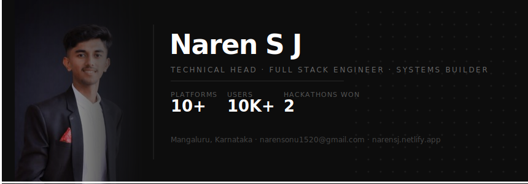

<div align="center">
  
</div>

<br/>

<div align="center">

[](https://narensj.netlify.app)
&nbsp;
[](https://linkedin.com/in/narensj20)
&nbsp;
[](https://github.com/Naren1520)
&nbsp;
[](mailto:narensonu1520@gmail.com)
&nbsp;
[](https://instagram.com/naren_s.j._)

</div>

---

## About

Software engineer and Technical Head at ISDC, focused on architecting and scaling production-grade platforms. I work across the full stack — from system design and backend infrastructure to frontend performance and team engineering standards. Currently building platforms that serve 10,000+ users and pursuing research in cryptographic offline payment protocols.

> BE in Information Science Engineering · Sahyadri College of Engineering and Management, Mangaluru (2028)

---

## Experience

```
Present ◄──────────────────────────────────────────── Oct 2024
   │
   ├── 👑  Technical Head @ ISDC (Promoted Feb 2026)
   │       ├─ Architecting 10+ production-grade platforms
   │       ├─ Standardised Next.js workflows → +30% efficiency
   │       └─ Mentoring devs · Conducting technical interviews
   │
   ├── 💼  Software Dev Intern @ Sahynex Tech Solutions (Oct 2025)
   │       ├─ Deployed platforms → 10,000+ active users
   │       └─ Cut page load time by 35% ⚡
   │
   └── 🚀  Full Stack Developer @ Challengers
           └─ Built Aerophilia 2025 platform → 2,000+ attendees
```

---

## Achievements

<div align="center">

| | Achievement |
|:---:|:---|
| 🏆 | **Winner** — HackHarbor 3.0 |
| 🏆 | **Winner** — GDG TechSprint |
| 🥇 | **Best Innovative Project** — Versathon 1.0 |
| 🚀 | **Finalist** — BuildForBillion (Incub8) |
| ☁️ | **Finalist** — AWS AI Prompt Challenge |
| 🌍 | **Semi-Finalist** — EY Techathon 6.0, India |

</div>

---

## Tech Stack

#### Languages


#### Frontend


#### Backend & Databases


#### Blockchain


#### DevOps & Cloud & Tools


---

## Projects

**SPManager** — AI-Powered Project Management Platform

`Next.js · MongoDB · Docker · Kubernetes · Socket.io · Redis · Cloudflare R2 · GitHub API`

- Reduced manual project management effort by 80% using AI-driven task automation
- Integrated a RAG model to parse requirement documents and auto-assign tasks by skill matching
- Real-time collaboration via Socket.io and Jitsi, cutting communication delays by 99%
- Scalable backend with database sharding and Bloom filters to optimise API throughput

**IoT-Based Hydrogen Monitoring System** — Client: HYDGEN

`Flutter · C · ESP32 · Firebase`

- Real-time hydrogen monitoring deployed in an industrial environment using ESP32
- Flutter app for live visualisation and hazard alerts, reducing response time by 90%
- Automated alert system improving detection reliability and operational safety

---

## Research

**Cryptographic Offline Payment Protocols & Chip Architecture** — *Ongoing*

- Developing a secure token-verification scheme to prevent double-spending in offline P2P transactions
- Evaluating low-latency cryptographic hardware for on-device verification without network round-trips

---

## GitHub Stats

<div align="center">
  
  
</div>

<div align="center">
  
</div>

---

## Contribution Activity

<div align="center">
  
</div>

---

<div align="center">
  
</div>
